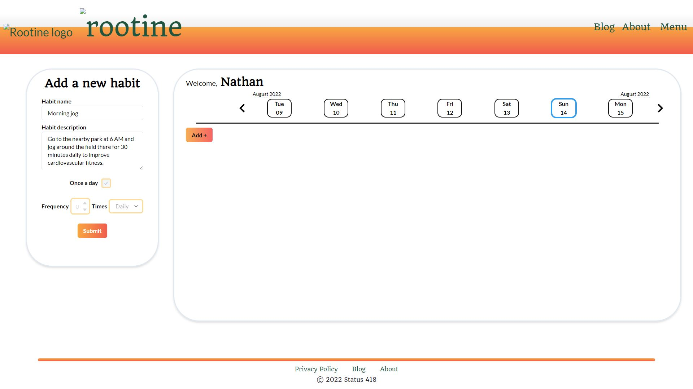

# Rootine - Team Status 418

### 🌱 _Plant the seeds of good habits_ 🌱

> ### “Sure, it’s easy to _start_ a new habit, but how do you make it stick?”

## Overview
TODO: Adjust tone <<<<<<<<<<<<<

[Open app](https://rootine.netlify.app "Rootine deployed on Netlify")
 

As our final project for School of Code, our team, _Status 418_, made "Rootine", a habit-tracking app developed in React. The purpose of this app is to allow users to define some daily habits that they would like to start (or keep) and be able to easily fill in and track their record of doing these habits over time. This app enables users to simply add a new habit along with a brief description and have this stored on our database. The user may then login in and open the page at a different time and update their progress for any day. 

A user can expect to logout and login on a different device and still be able to view their same habits and corresponding records for each date, all on that new device !

This repository contains the frontend code for the app, which has several features:

-   Landing page with an Auth0-integrated Log in/ Sign up flow
-   Calender row display with clickable arrows to see a different week
-   Details panel displaying the details of the currently selected habit
    +   Details of the currently selected habit may be edited through here as well
-   Form through which a new habit may be created, shown by clicking the "add +" button
-   A row of clickable items for each habit, indicating the status of the user's habit for that day - incomplete, complete, skipped or missed
 
 

## CSS Styling

| Color                              | Hex                                                              |
| ---------------------------------- | ---------------------------------------------------------------- |
| Gradient Red                       |  #f05d4d |
| Gradient Yellow                    |  #f8a642 |
| Primary Green                      |  #22553f |
| Primary Background                 |  #ffffff |
| Secondary Background (Auth0 login) |  #e8e9e3 |
| Primary Black (Text colour)        |  #121714 |

TODO: Add fonts list/ table <<<<<<<<

 

## Landing & Log in/ sign up pages

Upon first opening the app, the user is greeted by the screen below - a simple image, the app's slogan, as well as the login and sign up buttons.

Landing page preview

 

Clicking on either of these buttons redirects the user to an Auth0 authentication page,
where they may sign up for a new account (with any email, even a fake one), or login with an existing account, respectively.

Sign up & Log in pages preview

Clicking the _sign up_ button takes the user to this page
 

Clicking the _log in_ button takes the user to this (slightly different) page

 

## Main page
Upon signing up, the user is presented with this page. There are no habits currently added (since they only just signed up), but there is a section on the left, prompting the user to add a new habit as well as an "add" button which the user may click on to access the form view of that section. It is through this form that new habits are defined and submitted. 

Main page preview

 

### Habit Form:
The form view of the left section has a "Habit name" input, where the user can define the name of their new habit, as well as a "Habit description" input where a note may be made, giving more detail about that particular habit. Pressing the submit button will add this habit and its description to a database, and associate with the user's account. 

Habit form preview

 

### Calendar bar
This shows 1 weeks' worth of dates, where each date box is synchronised with a column of "habit items" for that date. Future and previous weeks are able to be viewed by clicking on the arrows to the left and right of this row, with the habit items below updating for the status of each habit for the newly displayed days.

Calendar bar preview

 

### Habit rows:
TODO: <<<<<<<<<<<<<<

Description of functionality and usage of habit row component

Habit row preview

 

### Details panel:
TODO: <<<<<<<<<<<<<<

Description of functionality and usage of details panel component

Detail panel preview

 

 

## Languages and Tools

 

  
  
 
  
  
  
  
  
  

