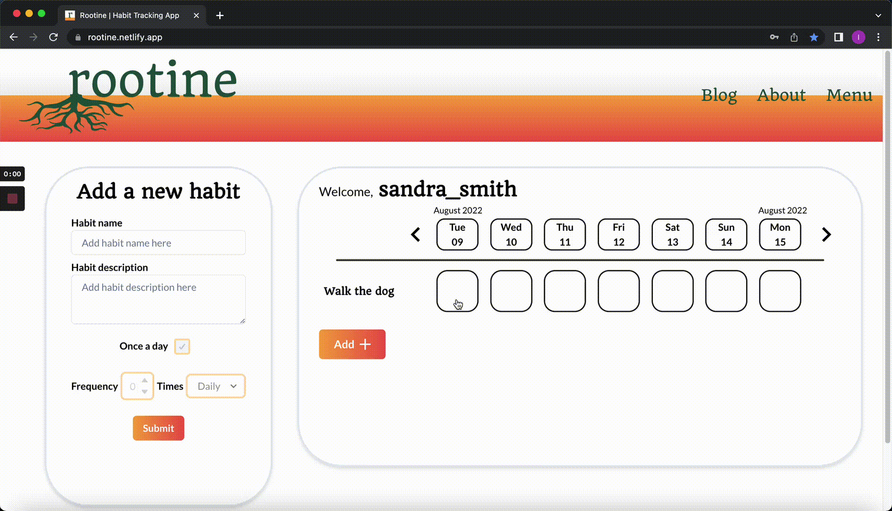

# Rootine - Team Status 418

### 🌱 _Plant the seeds of good habits_ 🌱

> ### “Sure, it’s easy to _start_ a new habit, but how do you make it stick?”

## Overview

[Open app](https://rootine.netlify.app "Rootine deployed on Netlify")
 

For our final project in the School of Code, our team, _Status 418_, made "Rootine", a habit-tracking app developed in React. The purpose of this app is to allow users to define daily habits that they would like to start (or keep) and be able to easily fill in and track their record of doing these habits over time. This app enables users to simply add a new habit along with a brief description and have this stored on our database.

They may then log in and open the page at a different time to change their habits' names or descriptions and update their progress for any day.

A user can expect to logout and login on a different device and still be able to view and edit their same habits and corresponding records for each date.

This repository contains the frontend code for the app, which has several features:

- Landing page with an Auth0-integrated Log in/ Sign up flow
- Form through which a new habit may be created, shown by clicking the "add +" button
- Details panel displaying the details of the currently selected habit
  - Details of the currently selected habit may be edited through here as well
- Calender row display with clickable arrows to see a different week
- A row of clickable items for each habit, indicating the status of the user's habit for that day - incomplete, complete, skipped or missed
   
   

## CSS Styling

| Color                              | Hex                                                                  |
| ---------------------------------- | -------------------------------------------------------------------- |
| Gradient Red                       |  #f05d4d |
| Gradient Yellow                    |  #f8a642 |
| Primary Green                      |  #22553f |
| Primary Background                 |  #ffffff |
| Secondary Background (Auth0 login) |  #e8e9e3 |
| Primary Black (Text colour)        |  #121714 |

 

| Font   | Usage    |
| ------ | -------- |
| Quando | Headings |
| Lato   | Body     |

 

## Landing & Log in/ sign up pages

Upon first opening the app, the user is greeted by the screen below - a simple image, the app's slogan, as well as the login and sign up buttons.

Landing page preview

 

Clicking on either of these buttons redirects the user to an Auth0 authentication page,
where they may sign up for a new account (with any email, even a fake one), or login with an existing account, respectively.

Sign up & Log in pages preview

Clicking the _sign up_ button takes the user to this page
 

Clicking the _log in_ button takes the user to this (slightly different) page

 

# Main page

Upon signing up, the user is presented with this page. There are no habits currently added (since they only just signed up), but there is a section on the left, prompting the user to add a new habit as well as an "add" button which the user may click on to access the form view of that section. It is through this form that new habits are defined and submitted.

Main page preview

 

## Adding a habit

 

The functionality of adding habits is part of the _HabitForm_ component.

The form view of the left section has a "Habit name" input, where the user can define the name of their new habit, as well as a "Habit description" input where a note may be made, giving more detail about that particular habit. Pressing the submit button will add this habit and its description to a database, and associate with the user's account.

Adding a new habit

 

## Tracking a habit

 

The functionality of tracking habits is part of the _Calendar_, _CalendarBar_ & _HabitRow_ components.

Upon submitting a habit and description, the user will see the new habit immediately appear in the main part of the screen, along with several clickable buttons. Each button, corresponding to the dates in the Calendar bar above, may be clicked to cycle between several colours:

- White - Incomplete (initial state) - The user is yet to complete the habit that day
- Green - Complete - The user successfully completed the habit that day
- Yellow - Skipped - The user did not complete the habit that day for reasons out of their control (e.g. The park was closed)
- Red - Missed - The user did not complete the habit that day

This provides a visualisation of the user's track record of sticking to their habits. The database will be update (or create a new entry) with the new status of that habit on that day as each button is clicked. There is also a streak feature to show how many days in a row the user has completed that habit.

### Calendar bar

This shows 1 weeks' worth of dates, where each date box is synchronised with a column of "habit items" for that date. Future and previous weeks are able to be viewed by clicking on the arrows to the left and right of this row, with the habit items below updating for the status of each habit for the newly displayed days.

Tracking a habit

 

## Modifying a habit

 

The functionality of modifying habits is part of the _DetailsPanel_ & _LeftSideHabitDetails_ components.

Users have the ability to edit the habit's name and description by clicking on an existing habit in the habit row. When clicked, this displays a details panel on the left side of the screen. Users can now click on the name and description in the details panel to make any changes. Once the user is satisfied with their changes, they can click on _save_ to update the habit's details.

Alternatively, users can delete an existing habit by clicking on the _delete_ button in the details panel for that habit.

This is also where the currently selected habit's streak is displayed.

Modifying and deleting an existing habit 

 

 

## Languages, Tools & Websites used:

 

 

## Authors

- [Bushra Fatima](https://github.com/BushraFatimaBF)
- [Hannah McFarlane](https://github.com/hcmcfarlane)
- [Idman Abshir](https://github.com/idman01)
- [Mordecai Oladimeji](https://github.com/MordecaiO)
- [Robert Angelitud](https://github.com/m4tchka)
- [Samantha Wu](https://github.com/syywu)
